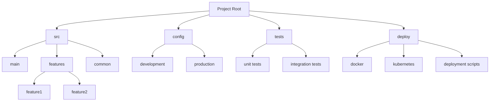

# CORE: Comprehensive, Organized Repository for Engineering

Welcome to **CORE**, a structured, dependency-driven architecture for software projects of any scale. CORE offers a **standardized modular folder structure (DDFS)** designed to simplify, scale, and enhance maintainability. With CORE, you get a predictable and organized setup that streamlines both individual and collaborative development.

---

## 💡 Why CORE?

**CORE** isn’t just a folder structure—it’s a framework that brings clarity, modularity, and predictability to your codebase.

- **Scalability**: CORE handles projects that grow over time with ease.
- **Collaboration**: The structure reduces merge conflicts and fosters teamwork.
- **Predictability**: Everything has a place, making it simple to find, use, and build on existing components.

With CORE, you won’t just organize files—you’ll optimize how your team works, builds, and scales.

---

## 🌐 Quick Look at the Structure

Here’s a glimpse into how CORE organizes code, configurations, and dependencies.



Each directory serves a clear purpose, making it easy to find what you need:

- **src/**: Core source code, with `main`, `features`, and `common` modules.
- **config/**: Environment configurations split by `development` and `production`.
- **tests/**: Unit and integration tests, kept separate for easy testing.
- **deploy/**: Docker, Kubernetes, and deployment scripts—everything you need to get your code running in production.

---

## 🚀 CORE at a Glance

- **Get Started Quickly**: CORE’s layout is intuitive, so teams get up to speed fast.
- **Keep It Clean**: With designated folders for every type of code, configurations, and tests, CORE ensures a clutter-free workspace.
- **Built for CI/CD**: The structure is compatible with automated testing, CI/CD, and other modern workflows.

---

## 📖 Dive Deeper: Why CORE Works

### 1. Predictable & Organized (The “Standard Way”)
CORE follows “The Standard Way”—a set of principles for modular, dependency-driven code organization that reduces chaos in your codebase. This approach creates **predictable, comparable, and estimable** software by aligning everything according to function and dependency.

### 2. Dependency-Driven Folder Structure (DDFS)
**DDFS** ensures that each module and configuration aligns logically within the project. Dependencies are clear, and changes in one area don’t impact others unexpectedly. CORE is designed to **minimize dependencies**, making it a perfect fit for both simple projects and complex, multi-team collaborations.

### 3. Scalability & Flexibility
CORE’s modular structure is **future-proof**, allowing for easy scaling as your project grows or new features are added.

---

## 🛠️ Using CORE: Where to Start

### Key Areas of the Repository

1. **Quick-Start Guide**: Jump in and set up your project with [quick-start-guide.md](./quick-start-guide.md).
2. **White Paper**: For an in-depth look at CORE’s principles, check out the [white-paper.md](./white-paper.md).
3. **Migration Guide**: Transition existing projects seamlessly with the [migration-guide.md](./migration-guide.md).

---

## 📂 Real-World Example: Before and After CORE

Here’s how CORE transforms a monolithic structure into a streamlined, modular setup.

**Before** (Monolithic):
```plaintext
project-root/
├── app.js
├── config.js
├── controllers/
├── models/
├── views/
└── tests/
```

**After** (CORE Structure):
```plaintext
project-root/
├── src/
│   ├── main/
│   ├── features/
│   └── common/
├── config/
├── tests/
└── deploy/
```

*With CORE, everything is structured for simplicity, clarity, and growth.*

---

## 🛠️ Sample CI/CD Workflow

Easily integrate CORE with CI/CD tools to automate testing and deployment. Here’s an example using GitHub Actions.

```yaml
# GitHub Actions Workflow
name: CI/CD Pipeline

on: [push]

jobs:
  build:
    runs-on: ubuntu-latest
    steps:
      - name: Checkout repository
        uses: actions/checkout@v2

      - name: Install dependencies
        run: npm install

      - name: Run tests
        run: npm test --prefix tests/
```

---

## 🔗 Additional Documentation

1. **[White Paper](./white-paper.md)**: Explore CORE’s foundations and principles.
2. **[Quick-Start Guide](./quick-start-guide.md)**: Get started with CORE in your projects.
3. **[Migration Guide](./migration-guide.md)**: Step-by-step instructions to refactor your existing projects into CORE.
4. **[FAQ Document](./faq-document.md)**: Answers to common questions about CORE.

---

## 🌐 Join the CORE Community

Explore, contribute, and join discussions as we refine the CORE approach to software engineering. Together, let’s build scalable, maintainable, and future-ready software.

---

*Embrace CORE to bring clarity and organization to your development projects. Find everything in its place, and make scaling up as simple as adding a new folder.*
