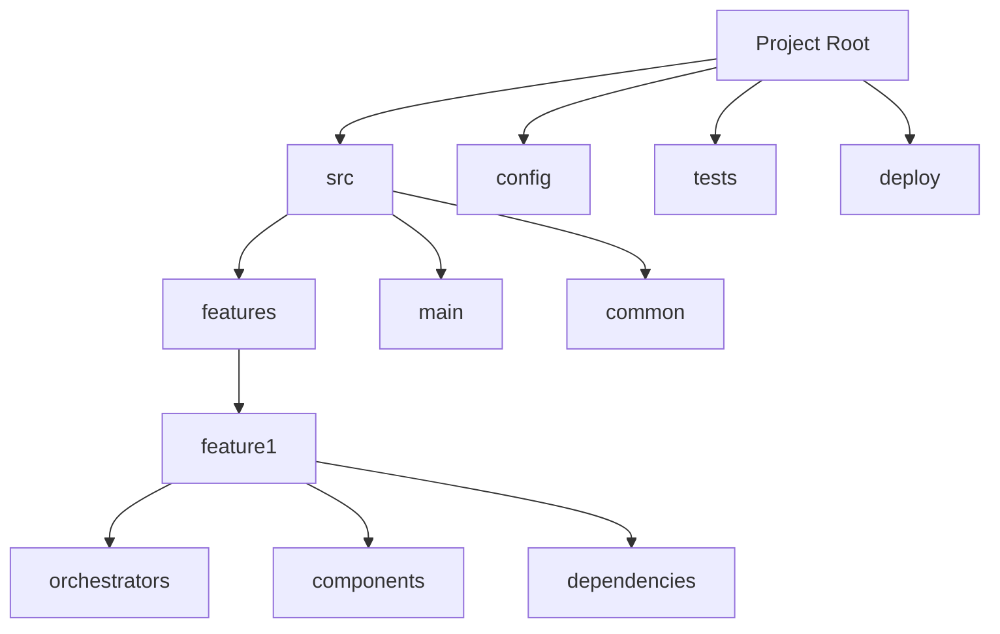

# CORE: Comprehensive, Organized Repository for Engineering

Welcome to **CORE**—a **gold standard** for organizing code across languages, frameworks, and architectures. CORE simplifies your project with a **Dependency-Driven Folder Structure (DDFS)**, focusing on clarity, scalability, and flexibility, making it ideal for **monorepos**, **microservices**, and **large-scale projects**. CORE’s adaptable, modular design ensures seamless integration across languages and platforms.

---

## Why CORE? 🚀

CORE isn’t just a folder structure; it’s a comprehensive, modular architecture that brings clarity, predictability, and scalability to your projects. Here’s a quick look at what CORE offers:

- **Language Agnostic**: Adapts to any language and framework, ideal for cross-platform teams.
- **Predictable and Scalable**: Each module is structured for growth, simplifying team collaboration and project scaling.
- **Clear and Intuitive Navigation**: Organizes code by dependencies and purpose, so everyone finds what they need faster.
- **Compatible with Frameworks**: CORE works across microservices, monoliths, and mono-repos, maintaining order as your project grows.

> CORE is more than just a folder structure—it’s a system that drives simplicity, clarity, and efficiency.

---

## Quick Overview of CORE Structure

CORE organizes code into clear layers, following **DDFS** (Dependency-Driven Folder Structure) principles. DDFS emphasizes a hierarchy where:
   - **Orchestrators** handle top-level flow and dependencies.
   - **Components** manage feature-specific tasks and services.
   - **Dependencies** handle reusable functionality across features.

Here’s a look at the CORE layout with **features/** as the primary organizational point.



---

## CORE in Action: Key Advantages

1. **Consistency Across Teams**: Each feature follows the same layout, making it easy to onboard new team members and maintain clarity in large codebases.
2. **Enhanced Modularity**: Independent feature folders allow teams to work in parallel, reducing code conflicts and increasing flexibility.
3. **Structured Flow from Design to Implementation**: Orchestrators and components ensure that design translates seamlessly into code, improving project alignment and reliability.

---

## Getting Started with CORE

Follow these steps to get the most out of CORE:

### Step 1: Understand the Basics

Each folder in CORE has a distinct role:

- **src/**: Core source code, split by `features/`, `main/`, and `common/`.
- **config/**: Configurations for different environments like development and production.
- **tests/**: Unit and integration tests, each aligned with `src/` modules.
- **deploy/**: Deployment files (Docker, Kubernetes, scripts) for easy CI/CD setup.

### Step 2: Explore Example Projects

Visit the `examples/` folder to see CORE’s modular approach in action across languages and frameworks.

### Step 3: Dive Deeper with Documentation

   - **[Quick-Start Guide](./quick-start-guide.md)**: Essential steps to set up CORE in your projects.
   - **[Migration Guide](./migration-guide.md)**: Transition existing projects to CORE seamlessly.
   - **[White Paper](./white-paper.md)**: Detailed insights into CORE’s architecture and practical benefits.

---

## CORE Folder Breakdown

The **features/** folder is the CORE of your project, organized by purpose and dependency:

1. **Orchestrators**: High-level modules coordinating feature workflows.
2. **Components**: Independent functional units handling specific tasks.
3. **Dependencies**: Reusable low-level functions, shared across modules.

Other essential folders include:
- **config/**: Config files by environment (e.g., dev, prod), making environment shifts seamless.
- **tests/**: Structured testing files to ensure robust and reliable builds.
- **deploy/**: CI/CD-ready scripts and configuration files (Docker, Kubernetes).

---

## Real-World Transformation with CORE

### Before and After: From Monolithic to Modular

**Before CORE (Monolithic Structure)**:
```plaintext
project-root/
├── app.js
├── config.js
├── controllers/
├── models/
├── views/
└── tests/
```

**After CORE (DDFS Structure)**:
```plaintext
project-root/
├── src/
│   ├── main/
│   ├── features/
│   │   ├── feature1/
│   │   │   ├── orchestrators/
│   │   │   ├── components/
│   │   │   └── dependencies/
│   └── common/
├── config/
├── tests/
└── deploy/
```

**Benefits**:
- **Simplified Maintenance**: Each feature is self-contained, with a clear dependency path for updates.
- **Scalability**: Isolated feature modules make the project adaptable and scalable.

---

## CI/CD with CORE

Below is a sample GitHub Actions workflow showcasing CORE’s CI/CD integration for seamless automation.

```yaml
# GitHub Actions Workflow
name: CI/CD Pipeline

on: [push]

jobs:
  build:
    runs-on: ubuntu-latest
    steps:
      - name: Checkout repository
        uses: actions/checkout@v2

      - name: Install dependencies
        run: npm install

      - name: Run tests
        run: npm test --prefix tests/
```

---

## Additional Documentation and Community

- **[Quick-Start Guide](./quick-start-guide.md)**: A practical guide to implementing CORE.
- **[Migration Guide](./migration-guide.md)**: Step-by-step guidance for transitioning to CORE.
- **[White Paper](./white-paper.md)**: A thorough look at CORE’s design philosophy and structure.

## Join the CORE Community

Whether you’re developing microservices, managing a monorepo, or scaling a large application, CORE provides a clear, modular foundation for success. Connect with us on GitHub Discussions, share your feedback, and help shape the future of organized, scalable software.

---

*CORE—setting the standard for modular, scalable, and organized software.*
